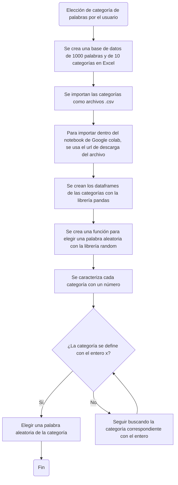

# Proyecto programación de computadores: Juego de ahorcado en python
## Grupo los 7 pecados de la programación:
### Steffy Geraldine Fernández González
### Andrés Felipe Sánchez Gómez
### Nilson Daniel Dueñas López

[](https://postimg.cc/QKpkbFcY)

## 1. Base de datos
#### La base de datos se creó en Excel, guardándose como archivo .csv para ser importado en python, luego, se crearon dataframes con la librería 'pandas' y por último, se creó una función para que se escoja una palabra aleatoria dentro de una categoría de palabras elegida por el usuario.

```python
import random as rnd
import pandas as pd

url_animales = "https://drive.google.com/uc?id=1wGh4yJJQzfXc8AV6f87IDl3wWbGEQsZI"
df_animales = pd.read_csv(url_animales)
url_carreras = "https://drive.google.com/uc?id=1O87RtJ01Z-lKkTl6KjefgbPgmyM44NOp"
df_carreras = pd.read_csv(url_carreras)
url_ciudades = "https://drive.google.com/uc?id=1PtqcC6XzLAAciRVpro9XFOE9-sKlKmAg"
df_ciudades = pd.read_csv(url_ciudades)
url_comida = "https://drive.google.com/uc?id=1IDJxKPFjAaTQEFMiQzcgxBUNeLoo_jxO"
df_comida = pd.read_csv(url_comida)
url_cuerpo_humano = "https://drive.google.com/uc?id=1lz01XfNK64sJT9k_1zZhhKFkSJpTTge4"
df_cuerpo = pd.read_csv(url_cuerpo_humano)
url_deportes = "https://drive.google.com/uc?id=14IuCv1HCanSvwkhbmh4yCzAoZHax10xT"
df_deportes = pd.read_csv(url_deportes)
url_objetos_casa = "https://drive.google.com/uc?id=1XLHQf8P3RdOQtN0RBpZIc4i0prwJFMbQ"
df_objetos = pd.read_csv(url_objetos_casa)
url_paises = "https://drive.google.com/uc?id=12KuAfMK-SmAU1YU0IODviI6kCdpIvbCL"
df_paises = pd.read_csv(url_paises)
url_tabla_periodica = "https://drive.google.com/uc?id=1B0Hf9zMl58a2cqgsqlEf4JabB79iNoQV"
df_tabla_periodica = pd.read_csv(url_tabla_periodica)
url_uni = "https://drive.google.com/uc?id=1C-CDN5XETfo7XbJF3lo_5QL_FhJYgWUr"
```
```python
def categoria_elegida_usuario(categoria_usuario,df_animales,df_carreras,df_ciudades,df_comida,df_cuerpo,df_deportes,df_objetos,df_paises,df_tabla_periodica,df_uni):
  if categoria_usuario == 1:
    palabra_aleatoria_animales = rnd.choice(df_animales['Animales'])
    return palabra_aleatoria_animales
  elif categoria_usuario == 2:
    palabra_aleatoria_carreras = rnd.choice(df_carreras['Carrera universitaria'])
    return palabra_aleatoria_carreras
  elif categoria_usuario == 3:
    palabra_aleatoria_ciudades = rnd.choice(df_ciudades['Ciudades'])
    return palabra_aleatoria_ciudades
  elif categoria_usuario == 4:
    palabra_aleatoria_comida = rnd.choice(df_comida['Comida'])
    return palabra_aleatoria_comida
  elif categoria_usuario == 5:
    palabra_aleatoria_cuerpo = rnd.choice(df_cuerpo['Cuerpo humano'])
    return palabra_aleatoria_cuerpo
  elif categoria_usuario == 6:
    palabra_aleatoria_deportes = rnd.choice(df_deportes['deportes'])
    return palabra_aleatoria_deportes
  elif categoria_usuario == 7:
    palabra_aleatoria_objetos = rnd.choice(df_objetos['objetos de la casa'])
    return palabra_aleatoria_objetos
  elif categoria_usuario == 8:
    palabra_aleatoria_paises = rnd.choice(df_paises['paises'])
    return palabra_aleatoria_paises
  elif categoria_usuario == 9:
    palabra_aleatoria_tabla_p = rnd.choice(df_tabla_periodica['elementos tabla periódica'])
    return palabra_aleatoria_tabla_p
  else:
    palabra_aleatoria_uni = rnd.choice(df_uni['universidad'])
    return palabra_aleatoria_uni

print(" 1.Animales \n 2.carreras universitarias \n 3.ciudades \n 4.comida \n 5.cuerpo humano \n 6.deportes \n 7.objetos de la casa \n 8.paises \n 9.elementos de la tabla periódica \n 10.universidad ")
categoria_usuario = int(input("Elija una categoría digitando el número correspondiente "))
funcion_prueba = categoria_elegida_usuario(categoria_usuario,df_animales,df_carreras,df_ciudades,df_comida,df_cuerpo,df_deportes,df_objetos,df_paises,df_tabla_periodica,df_uni)
print(funcion_prueba)
```
## 2. Comparador de la palabra y contador de intentos.
#### En principio esto se encarga de tomar la palabra y transferir cada caracter a una matriz para luego ser comparada con el input 
```python
palabra_dividida=[]
palabra_avance=[]
contador_vidas=5
letra_usuario = str
letra_intentos=[]
for i in range(0,len(funcion_prueba)):
    palabra_dividida.append(funcion_prueba[i])
    palabra_avance.append("")
# print(palabra_dividida)
# print(palabra_avance)
while contador_vidas>0:
    letra_usuario = str(input("Ingrese una letra : "))
    while letra_usuario in letra_intentos:
        letra_usuario = str(input("Ingrese una letra diferente: "))
    letra_intentos.append(letra_usuario)
    if letra_usuario in palabra_dividida :
            print("Correcto")
            for i in range(0,len(funcion_prueba)):
                if palabra_dividida[i]==letra_usuario:
                    palabra_avance[i]=letra_usuario
    else:
        contador_vidas-=1
        print("Incorrecto")
    print(palabra_avance)
```
### Definiendo las listas necesarias, siendo:
* palabra_dividida: sera la base para comparar el input (es posible con un string, lo decidimos hacer haci por comodidad)
* palabra_avance: sera donde se guarde los aciertos del input, y sera la usada para la condicion de victoria
* contador_vidas: simplemente el contador de errores, se podria hacer vidas respecto a las letras unicas de la palabra o preguntando cuantos intentos
* letra_usuario: input del usuario, se corrobora vs letra_intentos
* letra_intentos: donde se almancenan cada input unico del usuario

```python
palabra_dividida=[]
palabra_avance=[]
contador_vidas=5
letra_usuario =[]
letra_intentos=[]
```
### Creacion de listas:
* Primero se crea una con cada caracter de la palabra
* Se crea tambien una lista con indices vacios para tener el largo de la palabra donde se pueda ingresar los aciertos

```python
for i in range(0,len(funcion_prueba)):
    palabra_dividida.append(funcion_prueba[i])
    palabra_avance.append("")
```
### Comparador:
1. Primera parte:
  
+ while: Todo esta rodeado por un loop dependiente de el flag contador_vidas
+ input: Se pide una letra, entra a un loop para confirmar que esta letra no esta en la lista letra_intentos
+ letra_intentos: si se cumple con lo anterior se pasa a añadir la letra a letra_intentos
            
2.  Segunda parte
+Comparador: si la letra esta en palabra_dividida se dice Correcto y se pasa a comparar la letra en cada posicion de la lista, en el incide que este se cumpla se reemplaza el vacio con letra_usuario
+Sino: se resta una vida y se dice Incorrecto
```python
while contador_vidas>0:
    letra_usuario = str(input("Ingrese una letra : "))
    while letra_usuario in letra_intentos:
        letra_usuario = str(input("Ingrese una letra diferente: "))
    letra_intentos.append(letra_usuario)
    if letra_usuario in palabra_dividida :
            print("Correcto")
            for i in range(0,len(funcion_prueba)):
                if palabra_dividida[i]==letra_usuario:
                    palabra_avance[i]=letra_usuario
    else:
        contador_vidas-=1
        print("Incorrecto")
    print(palabra_avance)
```
