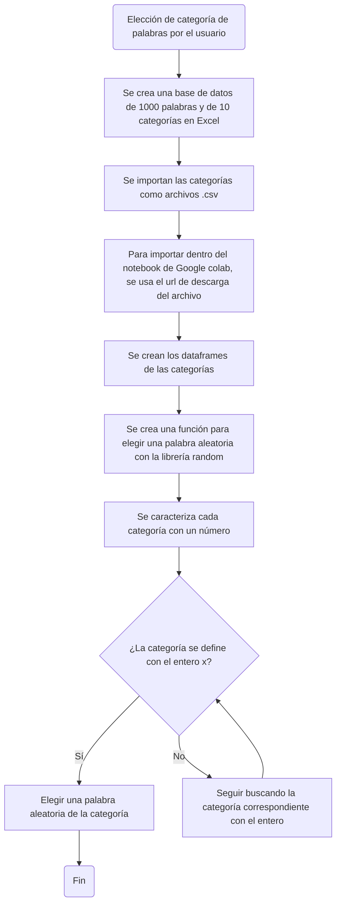

# Proyecto programación de computadores: Juego de ahorcado en python
## Grupo los 7 pecados de la programación:
### Steffy Geraldine Fernández González
### Andrés Felipe Sánchez Gómez
### Nilson Daniel Dueñas López

## Base de datos
#### La base de datos se creó en Excel, guardándose como archivo .csv para ser importado en python, luego, se crearon dataframes con la librería 'pandas' y por último, se creó una función para que se escoja una palabra aleatoria dentro de una categoría de palabras elegida por el usuario.

