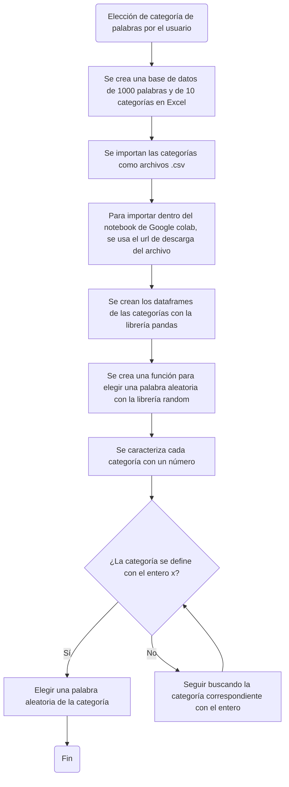

# Proyecto programación de computadores: Juego de ahorcado en python
## Grupo los 7 pecados de la programación:
### Steffy Geraldine Fernández González
### Andrés Felipe Sánchez Gómez
### Nilson Daniel Dueñas López

[](https://postimg.cc/QKpkbFcY)

## Base de datos
#### La base de datos se creó en Excel, guardándose como archivo .csv para ser importado en python, luego, se crearon dataframes con la librería 'pandas' y por último, se creó una función para que se escoja una palabra aleatoria dentro de una categoría de palabras elegida por el usuario.

## 2. Comparador de la palabra y contador de intentos.
#### EN principio esto se encarga de tomar la palabra y transferir cada caracter a una matriz para luego ser comparada con el input 
```python
palabra_dividida=[]
palabra_avance=[]
contador_vidas=5
letra_usuario = str
letra_intentos=[]
for i in range(0,len(funcion_prueba)):
    palabra_dividida.append(funcion_prueba[i])
    palabra_avance.append("")
# print(palabra_dividida)
# print(palabra_avance)
while contador_vidas>0:
    letra_usuario = str(input("Ingrese una letra : "))
    while letra_usuario in letra_intentos:
        letra_usuario = str(input("Ingrese una letra diferente: "))
    letra_intentos.append(letra_usuario)
    if letra_usuario in palabra_dividida :
            print("Correcto")
            for i in range(0,len(funcion_prueba)):
                if palabra_dividida[i]==letra_usuario:
                    palabra_avance[i]=letra_usuario
    else:
        contador_vidas-=1
        print("Incorrecto")
    print(palabra_avance)
```
### Definiendo las listas necesarias, siendo:
* palabra_dividida: sera la base para comparar el input (es posible con un string, lo decidimos hacer haci por comodidad)
* palabra_avance: sera donde se guarde los aciertos del input, y sera la usada para la condicion de victoria
* contador_vidas: simplemente el contador de errores, se podria hacer vidas respecto a las letras unicas de la palabra o preguntando cuantos intentos
* letra_usuario: input del usuario, se corrobora vs letra_intentos
* letra_intentos: donde se almancenan cada input unico del usuario

```python
palabra_dividida=[]
palabra_avance=[]
contador_vidas=5
letra_usuario =[]
letra_intentos=[]
```
### Creacion de listas:
* Primero se crea una con cada caracter de la palabra
* Se crea tambien una lista con indices vacios para tener el largo de la palabra donde se pueda ingresar los aciertos

```python
for i in range(0,len(funcion_prueba)):
    palabra_dividida.append(funcion_prueba[i])
    palabra_avance.append("")
```
### Comparador:
1. Primera parte:
  
+ while: Todo esta rodeado por un loop dependiente de el flag contador_vidas
+ input: Se pide una letra, entra a un loop para confirmar que esta letra no esta en la lista letra_intentos
+ letra_intentos: si se cumple con lo anterior se pasa a añadir la letra a letra_intentos
            
2.  Segunda parte
+Comparador: si la letra esta en palabra_dividida se dice Correcto y se pasa a comparar la letra en cada posicion de la lista, en el incide que este se cumpla se reemplaza el vacio con letra_usuario
+Sino: se resta una vida y se dice Incorrecto
```python
while contador_vidas>0:
    letra_usuario = str(input("Ingrese una letra : "))
    while letra_usuario in letra_intentos:
        letra_usuario = str(input("Ingrese una letra diferente: "))
    letra_intentos.append(letra_usuario)
    if letra_usuario in palabra_dividida :
            print("Correcto")
            for i in range(0,len(funcion_prueba)):
                if palabra_dividida[i]==letra_usuario:
                    palabra_avance[i]=letra_usuario
    else:
        contador_vidas-=1
        print("Incorrecto")
    print(palabra_avance)
```
